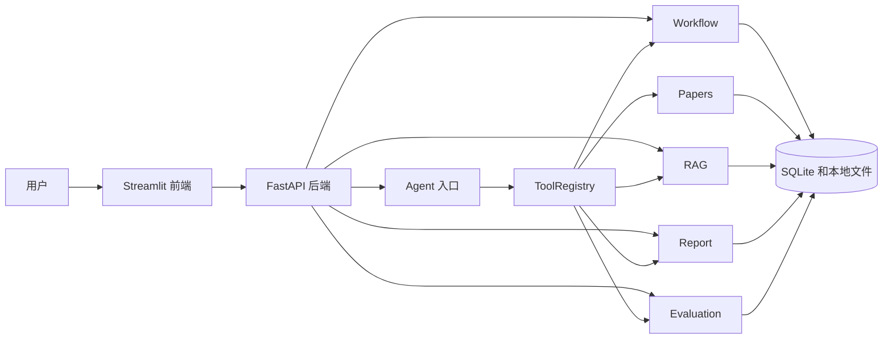
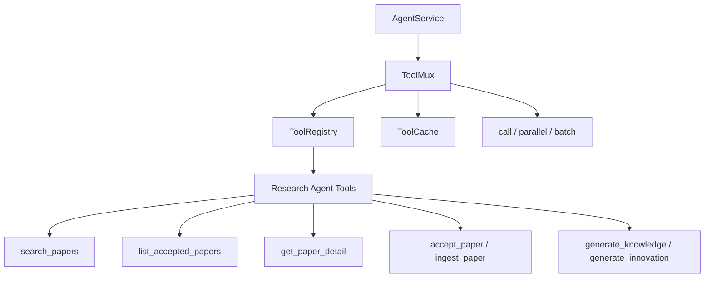

# Research Reading Agent

一个本地运行的科研论文阅读与整理工作台，用于辅助个人完成论文收集、阅读归纳、知识结构整理、研究报告沉淀和后续查询复盘。

## 1. 这个项目是什么

Research Reading Agent 是一个本地科研论文阅读与整理工作台。它包含 FastAPI 后端和 Streamlit 中文前端，用户可以从一个研究方向出发，逐步收集论文、整理阅读结果、生成知识结构和研究报告。

它不是普通聊天机器人。普通聊天机器人通常只生成一段回答，而这个项目会调用后端工具，记录搜索结果、workflow run、RAG trace 和评估反馈。

它也不是单纯的论文搜索工具。项目把论文收集、阅读整理、知识归纳、报告沉淀和后续查询串在一起，方便复盘每一步做了什么、用了哪些材料、哪里需要继续补充。

它的重点不是自动写论文，而是把本地研究过程组织成可记录、可查询、可复盘的工作流。

## 2. 它解决什么问题

科研阅读中常见的问题不是“找不到信息”，而是信息很快变得分散：

- 搜索到论文后，后续接收、精读和整理很难持续记录。
- 摘要、知识结构、创新点和阅读笔记容易散落在不同地方。
- 本地检索回答如果只返回答案，很难知道答案来自哪些论文片段。
- 检索效果好不好，通常缺少 trace 和反馈记录来复盘。

Research Reading Agent 的目标是提供一个本地可运行的流程：从研究方向开始，逐步得到论文记录、阅读结果、知识树、创新点、Markdown 报告和后续查询记录。

## 3. 整体架构

项目分为两层：

- Streamlit 前端：提供中文页面，适合本地操作。
- FastAPI 后端：提供 API、Agent 编排、研究流程、报告、本地检索和持久化能力。

数据主要保存在 SQLite 和本地文件目录中。



FastAPI 应用入口是 `app.main:app`。开发调试可以打开 `/docs` 查看接口。

## 4. 核心流程

Research Workflow 是项目的主流程，用来把一次研究方向整理成可复盘的记录：

```text
输入研究方向
-> 搜索论文
-> 接收论文
-> ingest
-> 建立本地检索索引
-> 生成知识树
-> 生成创新点
-> 保存 workflow run
-> 生成 Markdown 报告
```

这个流程对应接口：

```text
POST /api/workflow/run
```

每次运行会生成一个 `run_id`。之后可以通过 `run_id` 查询详情、生成报告或读取报告。

### dry_run

`dry_run` 用于本地演示和调试。开启后：

- 不访问 arXiv。
- 不下载 PDF。
- 不调用 OpenAI。
- 不写入真实论文、知识树和创新点业务表。
- 返回明确标注为 dry_run/mock 的模拟结果。

`dry_run` 不代表真实论文检索结果。它适合无网络或无 API Key 时体验完整流程结构。

## 5. Agent 是怎么工作的

`/api/agent/query` 是统一自然语言入口。用户可以输入类似：

```text
你能做什么
围绕 large language model agent 完整跑一遍研究流程
查看最近一次研究闭环结果
把最近一次 workflow 生成报告
```

当前 Agent 是“单轮工具路由 + 复合 workflow 工具”的设计，不是复杂的多步自主规划 Agent。

核心模块：

- `fallback_router.py`：负责规则路由。在没有 LLM 或 LLM 路由失败时，根据关键词和正则选择工具。
- `argument_resolver.py`：负责补齐参数，例如 `paper_id`、`run_id`、`trace_id`、`top_k`。
- `tool_registry.py`：负责把工具名映射到具体 service。
- `answer_builder.py`：负责把工具返回结果整理成用户可读的 `final_answer`。
- `orchestrator.py`：串联路由、参数解析、工具调用和响应结构。

这样的设计比较直接，便于测试，也方便后续替换其中某一层。

## 6. ToolMux：内部工具调用多路复用层

ToolMux 是一个轻量的 Python 内部工具调度层，设计上参考了 callmux 的工具调用多路复用思想。它不是完整 MCP callmux，也不直接处理 MCP transport；在本项目中，它用于优化 `research_agent` 内部工具函数的调度方式。

当前 ToolMux 支持：

- `call()`：单次调用一个已注册工具。
- `parallel()`：并发调用多个互不依赖的工具。
- `batch()`：对同一个工具使用多组参数批量调用。
- read-only cache：只缓存真正只读的工具结果。
- partial failure：并发或批量调用中，单个工具失败不会拖垮整体，会返回 `failed_indexes`。



安全边界：

- ToolMux 支持显式 `read_only` 标记，避免仅凭工具名前缀误判缓存策略。
- `search_papers` 虽然是 `search` 前缀，但当前实现会写入搜索结果数据库，因此在 `tool_mux_factory.py` 中显式标记为 `read_only=False`。
- `accept_paper`、`ingest_paper`、`generate_knowledge`、`generate_innovation` 都是非只读工具，不进入缓存。

AgentService 已做低风险接入：

- 在 `app/services/agent_service.py` 中新增 `self.tool_mux`。
- 新增 `run_parallel_tools()`，用于显式调用 ToolMux 的并行调度能力。
- 没有修改原有 `query()` 主流程。
- 没有替换现有 intent 分发逻辑。

关键文件：

- `app/services/tool_mux.py`
- `app/agent/tool_mux_factory.py`
- `app/services/agent_service.py`
- `scripts/demo_tool_mux.py`
- `scripts/demo_research_tool_mux.py`
- `tests/test_tool_mux.py`
- `tests/test_agent_tool_mux_integration.py`

验证命令：

```bash
.venv/bin/python -m pytest tests/test_tool_mux.py tests/test_agent_tool_mux_integration.py

.venv/bin/python scripts/demo_tool_mux.py
.venv/bin/python scripts/demo_research_tool_mux.py
```

## 7. PaperWeave 论文证据织网

PaperWeave 是这个工作台里的论文证据织网方法。它的作用是让已经 ingest 的论文文本可以被再次查询，并记录每次查询命中了哪些证据片段。当前实现包含两种本地轻量模式：

- 使用 SQLite 保存 `rag_chunks`。
- keyword 模式使用 keyword / token overlap 做检索。
- hybrid 模式提供 PaperWeave 检索引擎：使用 contextual chunk、可配置 embedding provider 的 dense retrieval、sparse retrieval、RRF fusion 和 deterministic rerank。
- 返回 evidence chunks、`matched_terms` 和 `score_reason`。
- 没有证据时不编造答案。
- 每次 RAG search / answer 可以保存 trace。
- 每次 search / answer 会构造 Evidence Pack（证据包，内部仍复用 `context_pack` 字段），记录 session recent search、active paper 和 evidence 上下文。
- trace metadata 会记录 `retrieval_mode`、`pipeline` 和 `context_pack_id`，便于复盘一次检索实际走过的链路。
- 支持 trace-level feedback 和 evidence-level feedback。
- 可以计算 Recall@K、MRR、nDCG@5 等轻量指标。

当前 PaperWeave 仍使用本地轻量 hybrid retrieval，不依赖外部 API，不引入 Qdrant，也不是生产级向量库。默认 dense retrieval 使用纯 Python hash embedding，它用于本地可测、无外部依赖、稳定回归；同时已支持可选 sentence-transformers provider，用于更真实的 dense retrieval。

启用可选 sentence-transformers provider 时，先安装额外依赖：

```bash
pip install -r requirements-paperweave-optional.txt
```

然后配置：

```env
RAG_EMBEDDING_PROVIDER=sentence-transformers
RAG_SENTENCE_TRANSFORMERS_MODEL=sentence-transformers/all-MiniLM-L6-v2
RAG_SENTENCE_TRANSFORMERS_DEVICE=auto
RAG_EMBEDDING_BATCH_SIZE=32
```

启用 sentence-transformers 后，建议使用 PaperWeave 标准问题集和 PaperWeave 评估看板对比 `hybrid` / `keyword` 以及不同 embedding provider 的结果。

明确边界：尚未接入 Qdrant，尚未实现 GraphRAG，外部 reranker 也尚未接入。sentence-transformers 只是可选 provider；默认测试环境不要求安装它。

RAG answer 只基于已索引的文本片段做保守回答，不等价于通读全部论文后的完整综合判断。

新增可观测性能力：

- 前端新增“PaperWeave 调试台”，这是科研阅读工作台中的调试能力，不是把项目改成独立检索演示项目。
- Evidence Debugger：查看 evidence 表格、分数、正文预览和 raw JSON。
- Evidence Pack Viewer：查看当前响应中的 Evidence Pack（证据包），或根据指定 `context_pack_id` 加载历史证据包。
- Pipeline Viewer：查看 `retrieval_mode`、candidate 数量、RRF、rerank 和 embedding provider 等 pipeline 信息。
- Raw response JSON：保留完整响应，方便调试检索链路。

相关接口包括：

```text
POST /api/rag/index
POST /api/rag/search
POST /api/rag/answer
GET  /api/rag/context-packs/{context_pack_id}
GET  /api/rag/context-packs?user_id=default&session_id=default&limit=10
GET  /api/rag/traces/latest
GET  /api/rag/traces/{trace_id}
GET  /api/rag/evaluation/summary
GET  /api/rag/evaluation/evidence-summary
```

现有 API 路径暂保持 `/api/rag/...`，用于兼容已有接口。`GET /api/rag/context-packs/{context_pack_id}` 用于读取单个 Evidence Pack（证据包）；`GET /api/rag/context-packs?user_id=default&session_id=default&limit=10` 用于查看指定 `user_id` / `session_id` 最近生成的证据包，`limit` 目前限制为 1 到 50。

后端服务启动后，可以用本地 smoke 脚本手动验证 PaperWeave 检索链路：

```bash
.venv/bin/python scripts/smoke_rag_v2.py \
  --base-url http://127.0.0.1:8000 \
  --paper-id 1 \
  --query "这篇论文的方法和实验结论是什么？" \
  --retrieval-mode hybrid
```

脚本会依次检查 `/health`、可选 `/api/rag/index`、`/api/rag/search`、`/api/rag/answer`，并在返回 `context_pack_id` 时读取 `/api/rag/context-packs/{context_pack_id}`。

新增 PaperWeave 标准问题集质量评估脚本，用于在替换 embedding、向量库或 reranker 前形成本地可回归的检索质量基线。示例文件位于 `eval/golden_queries.example.jsonl`；本地私有评估集建议复制为 `eval/golden_queries.local.jsonl`，该文件已被 git ignore。

只评估 search：

```bash
.venv/bin/python scripts/eval_rag_v2.py \
  --base-url http://127.0.0.1:8000 \
  --golden-file eval/golden_queries.example.jsonl \
  --retrieval-modes hybrid,keyword \
  --top-k 5
```

同时做 answer 文本轻量命中检查：

```bash
.venv/bin/python scripts/eval_rag_v2.py \
  --base-url http://127.0.0.1:8000 \
  --golden-file eval/golden_queries.example.jsonl \
  --retrieval-modes hybrid,keyword \
  --top-k 5 \
  --run-answer
```

当前指标是轻量规则评估，不是 LLM-as-judge；适合做本地回归和版本对比。后续可以扩展为 RAGAS、人工标注集或更严格的 citation faithfulness 检查。

前端新增“PaperWeave 评估看板”，用于查看 `eval/rag_eval_runs/*.json` 的 summary、`by_retrieval_mode` 和 results 明细，方便比较 `hybrid` / `keyword` 的本地评估结果。`eval/rag_eval_runs/` 仍然是 ignored，不进入 Git。这个看板只读取本地评估结果，不自动运行评估，也不调用外部 API；当前评估仍是轻量规则评估，不是 LLM-as-judge。

详细说明见 [docs/rag_v2_context_pack.md](docs/rag_v2_context_pack.md)。

## 8. 前端界面

Streamlit 前端位于 `frontend/streamlit_app.py`，页面为中文：

- 仪表盘
- 智能体对话
- 运行研究流程
- 研究流程历史
- 研究报告
- 论文查询与复盘
- PaperWeave 调试台
- PaperWeave 评估看板
- 检索质量评估

这是一个产品原型，用来把后端能力组织成可操作页面。它不是最终生产级前端。

## 9. 项目结构

```text
app/        FastAPI 后端、Agent 编排、service、repository 和 schema
frontend/   Streamlit 中文前端原型
docs/       架构、API、本地检索边界和发布检查文档
scripts/    本地 curl 演示脚本
tests/      pytest 测试
data/       本地数据目录，只提交 .gitkeep，占位真实运行产物
```

主要入口：

```text
app/main.py
frontend/streamlit_app.py
```

## 10. 本地启动

创建环境：

```bash
python -m venv .venv
source .venv/bin/activate
pip install -r requirements.txt
```

如果只是体验 `dry_run`，不配置 API Key 也可以启动。需要配置环境变量时，可以先复制示例文件：

```bash
cp .env.example .env
```

启动后端：

```bash
python -m uvicorn app.main:app --reload
```

后端会占用当前终端。请另开一个终端，重新激活虚拟环境后启动前端：

启动前端：

```bash
source .venv/bin/activate
python -m streamlit run frontend/streamlit_app.py
```

访问：

```text
FastAPI docs: http://127.0.0.1:8000/docs
Streamlit 前端: http://localhost:8501
```

## 11. 快速体验

推荐先用 `dry_run` 跑通流程：

1. 启动 FastAPI 后端。
2. 启动 Streamlit 前端。
3. 打开 `http://localhost:8501`。
4. 进入“运行研究流程”。
5. 点击“运行演示流程”。
6. 回到“仪表盘”查看 latest workflow。
7. 到“研究报告”页面生成 Markdown 报告。

也可以直接调用 API：

```bash
curl -X POST http://127.0.0.1:8000/api/workflow/run \
  -H "Content-Type: application/json" \
  -d '{"topic":"large language model agent","max_results":3,"accept_top_k":2,"dry_run":true,"index_rag":true}'
```

## 12. 测试

运行全量轻量测试：

```bash
PYTHONDONTWRITEBYTECODE=1 .venv/bin/pytest -p no:cacheprovider tests
```

测试覆盖的主要范围：

- Agent 路由
- Agent endpoint 响应结构
- 参数解析
- Research Workflow
- Workflow report
- 本地检索 search / answer
- evidence trace
- trace-level feedback
- evidence-level feedback
- evaluation
- closed-loop dry_run

当前本地测试结果为 `198 passed`。

## 13. 当前边界

这个项目仍然是本地原型，有几个边界需要明确：

- keyword 模式仍是本地关键词 / token overlap 检索。
- PaperWeave hybrid 模式是本地轻量 hybrid retrieval，不是 Qdrant / 生产级向量库。
- 默认 embedding provider 仍是 hash；sentence-transformers 是可选 provider，需要额外安装和配置。
- 当前没有接入 Qdrant、GraphRAG 或外部 reranker。
- `dry_run` 是模拟流程，不代表真实论文检索结果。
- SQLite 适合本地原型，不是生产数据库。
- Streamlit 是产品原型，不是正式前端。
- LLM router 不是当前主线。
- 真实论文流程依赖网络、论文源和可选 LLM 配置。
- 飞书接口仅保留扩展雏形，不是完整 Bot。

## 14. 后续计划

后续可以继续补这些方向：

- Qdrant 向量库后端
- 外部 reranker
- GraphRAG
- 异步任务队列
- 用户和项目隔离
- PostgreSQL
- 正式前端
- 部署

这些能力目前不是已实现功能。

## 15. 文档入口

- 系统架构说明：[docs/agent_architecture.md](docs/agent_architecture.md)
- 核心 API 清单：[docs/core_api_checklist.md](docs/core_api_checklist.md)
- 本地 RAG v1 能力边界：[docs/rag_v1_quality_boundary.md](docs/rag_v1_quality_boundary.md)
- PaperWeave 论文证据织网方法：[docs/rag_v2_context_pack.md](docs/rag_v2_context_pack.md)
- 发布前检查清单：[docs/project_freeze_checklist.md](docs/project_freeze_checklist.md)
- Streamlit 前端说明：[frontend/README.md](frontend/README.md)
- 本地 curl 演示脚本：[scripts/demo_curl_examples.sh](scripts/demo_curl_examples.sh)

## 16. License

本项目采用 MIT License，详见 [LICENSE](LICENSE)。
