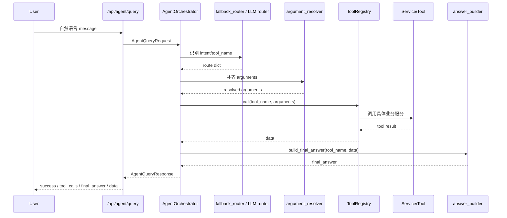

# Agent 架构说明

本文档说明 Research Reading Agent 的 Agent 设计边界和当前实现链路。项目定位是本地科研阅读工作台，Agent 入口用于把自然语言请求转成具体工具调用。

## 1. 为什么这是 Agent，而不是普通 API 后端

普通 API 后端通常要求用户明确调用某个接口，例如“我要调用 `/api/papers/search` 并传入 topic”。Research Reading Agent 多了一层自然语言编排能力：

- 用户可以说“帮我搜索 3 篇关于 LLM agent 的论文”。
- 用户也可以说“围绕 LLM agent 完整跑一遍研究流程”。
- 系统先识别意图，再解析参数，再选择工具。
- 工具返回结构化数据后，系统再生成面向用户的 `final_answer`。

也就是说，`/api/agent/query` 不是单一业务接口，而是一个统一调度入口。它把多个后端工具组织成一个可通过自然语言使用的研究助手。

当前 Agent 是单轮单工具 Agent，不是多步自治 Agent。这个边界是有意保留的：MVP 阶段优先保证可控、可测试、可解释。

新增的 `run_research_workflow` 是一个复合工具：它内部按固定顺序执行搜索、接收、ingest、RAG 索引、知识树和创新点，但从 Agent 编排视角看仍然是一次工具调用。该工具也支持 `dry_run=true`，用于无网络、无 API Key 的本地演示；dry_run 结果会明确标注为模拟数据，不代表真实检索、真实 RAG 索引或真实生成。

当前 PaperWeave 是支撑科研阅读的论文证据织网方法：已 ingest 论文文本会被切分为 chunks，保存到 SQLite `rag_chunks` 表。keyword 模式使用本地关键词 / token overlap 检索；hybrid 模式提供 contextual chunking、本地 hash dense retrieval、sparse retrieval、RRF fusion 和 deterministic rerank。PaperWeave 不调用 OpenAI embedding，不接 Qdrant，不引入外部 reranker，回答也先采用模板化保守生成。现在 workflow 会在 ingest 后按 `index_rag` 开关自动建立索引，形成“读论文 -> 建索引 -> 后续检索问答”的主闭环。Evidence 会返回 `matched_terms` 和 `score_reason`，并在 no evidence 时明确拒绝基于文档回答。每次 search / answer 默认保存 Evidence Trace，记录 query、evidence、answer 和 no_evidence 状态；人工 feedback 会基于这些 trace 形成轻量 evaluation summary，evidence-level feedback 会进一步计算 Recall@K、MRR 和 nDCG@5。

## 2. `/api/agent/query` 的完整链路

入口文件：

- `app/api/routes_agent.py`
- `app/services/agent_service.py`
- `app/agent/orchestrator.py`

请求链路：



响应结构包含：

```text
success
intent
chosen_tool
tool_calls
final_answer
data
error
routing_method
answer
used_tool
```

`answer` 和 `used_tool` 是兼容旧字段。

## 3. `fallback_router.py` 的职责

文件：`app/agent/fallback_router.py`

职责：

- 在没有 `OPENAI_API_KEY` 或 LLM 路由失败时提供稳定 fallback。
- 根据关键词和正则识别用户意图。
- 输出和 LLM router 兼容的 route dict。

当前支持的工具路由：

- `help`
- `search_papers`
- `accept_paper`
- `ingest_paper`
- `list_accepted_papers`
- `get_paper_detail`
- `generate_knowledge`
- `generate_innovation`
- `run_research_workflow`
- `get_latest_workflow`
- `list_workflow_history`
- `get_workflow_detail`
- `generate_workflow_report`
- `get_workflow_report`
- `index_paper_rag`
- `rag_search`
- `rag_answer`

它也负责一些纯文本解析：

- `P12` -> `paper_id=12`
- `第 2 篇` -> `ordinal=2`
- `给我 3 篇` -> `max_results=3`
- 从搜索句子中提取 topic
- 从“完整研究流程 / 研究闭环 / 一键完成”等句子中提取 workflow topic
- 从“dry run / dry_run / mock / 模拟 / 不联网 / 演示”等句子中识别 workflow dry_run 模式
- 从“最近一次研究闭环 / 上一次 workflow / workflow 历史”等句子中识别 workflow 查询意图
- 从“生成研究报告 / 查看 workflow 报告 / run_xxx 的研究报告”等句子中识别 workflow report 意图
- 从“建立 RAG 索引 / 在已索引论文中搜索 / 基于论文内容回答”等句子中识别 RAG 意图

注意：fallback router 只负责“看起来应该调用哪个工具，以及初步参数是什么”，不负责访问数据库、不负责调用工具。

## 4. `argument_resolver.py` 的职责

文件：`app/agent/argument_resolver.py`

职责：

- 对 route 中的 arguments 做最终补齐。
- 对搜索工具补齐 `topic`、`max_results`、`topic_id`、`user_id`、`session_id`。
- 对论文操作工具解析最终 `paper_id`。
- 对 `run_research_workflow` 补齐 `topic`、`max_results`、`accept_top_k`、`dry_run`、`index_rag`、`rag_chunk_size`、`rag_chunk_overlap` 和其他开关参数。
- 对 `list_workflow_history` 补齐 `limit`，对 `get_workflow_detail` 校验 `run_id`。
- 对 `generate_workflow_report` 和 `get_workflow_report` 透传 `run_id`；没有 run_id 时传 `None`，由工具层默认使用 latest workflow run。
- 对 `index_paper_rag` 解析 `paper_id` 或“第 N 篇”。
- 对 `rag_search` 和 `rag_answer` 补齐 `query`、`top_k`，并可选解析 `paper_id` 或“第 N 篇”。
- 支持通过 `session_repo.resolve_recent_position()` 把“第 N 篇”映射成最近搜索结果里的 `paper_id`。

示例：

```text
用户：接收第 2 篇
fallback_router: {"ordinal": 2}
argument_resolver: {"paper_id": 102}
```

如果缺少必要参数，例如“接收论文”，resolver 会抛出 `ValueError`，由 orchestrator 捕获并返回安全失败响应。

## 5. `answer_builder.py` 的职责

文件：`app/agent/answer_builder.py`

职责：

- 根据 `tool_name` 和工具返回数据构造 `final_answer`。
- 保持面向用户的回答风格稳定。
- 让 orchestrator 不再承担大量模板拼接逻辑。

示例：

- `search_papers`：返回“已找到 N 篇候选论文...”
- `accept_paper`：返回“已接收论文 Pxx...”
- `generate_knowledge`：返回知识树生成方式和归档路径。
- `run_research_workflow`：返回搜索、接收、ingest、RAG 索引、知识树和创新点的汇总。
- `run_research_workflow` 且 `dry_run=true`：在回答里明确提示当前是演示模式。
- `get_latest_workflow`：返回最近一次 workflow 的 topic、run_id、状态和数量统计。
- `list_workflow_history`：返回最近 workflow run 摘要列表。
- `get_workflow_detail`：返回指定 run_id 的 workflow 摘要和提醒。
- `generate_workflow_report`：返回 report_path 和生成成功提示。
- `get_workflow_report`：返回 report_path 和报告内容预览。
- `index_paper_rag`：返回 paper_id、chunk_count 和 warnings。
- `rag_search`：返回 evidence chunks 摘要。
- `rag_answer`：返回基于 evidence 的保守回答。

answer builder 不负责路由、不负责参数解析、不负责数据库操作。

## 6. `ToolRegistry` 的职责

文件：`app/agent/tool_registry.py`

职责：

- 维护工具名到实际函数的映射。
- 把 Agent 层的 `tool_name` 转成具体 service 调用。
- 将 Pydantic model 结果转换为 dict，方便 Agent 响应返回。
- 保存最近搜索结果到 `session_state`，用于“第 N 篇”解析。

当前注册工具：

- `search_papers`
- `accept_paper`
- `ingest_paper`
- `list_accepted_papers`
- `get_paper_detail`
- `generate_knowledge`
- `generate_innovation`
- `run_research_workflow`
- `get_latest_workflow`
- `list_workflow_history`
- `get_workflow_detail`
- `generate_workflow_report`
- `get_workflow_report`
- `index_paper_rag`
- `rag_search`
- `rag_answer`
- `get_latest_rag_traces`
- `get_rag_trace_detail`
- `get_rag_traces_by_paper`
- `add_rag_trace_feedback`
- `get_rag_evaluation_summary`
- `get_rag_trace_evaluation_detail`
- `add_rag_evidence_feedback`
- `get_rag_evidence_evaluation_summary`
- `get_rag_trace_evidence_evaluation`
- `help`

其中 `run_research_workflow` 会透传 `dry_run`、`index_rag`、`rag_chunk_size` 和 `rag_chunk_overlap` 参数；当 `dry_run=true` 时，workflow service 会在内部直接返回模拟结构，不访问 arXiv、OpenAI、PDF 下载，也不写 papers / knowledge / innovation 业务表或真实 `rag_chunks`。dry_run run 本身仍会保存到 `workflow_runs`，并带有 `dry_run=true` 标记。
workflow 执行结束后会保存到 `workflow_runs` 表，查询工具会复用 `ResearchWorkflowService` 和 `WorkflowRunRepository` 读取最近结果、历史摘要和完整详情。
Workflow Report 工具会复用 `WorkflowReportService`，把 workflow result_json 渲染成 Markdown，并保存到 `data/archives/workflow_reports/`。当前报告是模板生成，不调用 LLM。
RAG 工具会复用 `RagService`，完成论文文本索引、SQLite chunk 检索、模板化证据回答和 evidence trace 记录。workflow 也复用同一个 `RagService.index_paper_for_rag()`，在 ingest 后为成功深入阅读的论文建立索引。它支持 keyword 模式和 PaperWeave 本地轻量 hybrid 模式；当前不包含 Qdrant、真实 sentence-transformers embedding、外部 reranker 或 LLM 证据融合。
RAG Trace 工具会读取 `rag_traces` 表，支持查看最近 trace、单条 trace 详情，以及某篇论文相关 trace。它用于人工复盘和后续评估，不参与 workflow 主闭环执行。
RAG Evaluation 工具会读取 `rag_trace_feedback` 表，支持为 trace 添加人工相关性标注、查看整体评估摘要，以及查看单条 trace 的评估详情。当前 summary 基于最新 feedback 统计，不做自动判分。
RAG Evidence Evaluation 工具会读取 `rag_evidence_feedback` 表，支持为单条 evidence chunk 标注 `relevance_score=0/1/2`，并基于最新标注统计 Recall@1/3/5、MRR 和 nDCG@5。

## 7. 当前是单轮单工具 Agent 的原因和边界

当前每次 `/api/agent/query` 只选择一个工具执行。原因：

- 方便测试：每个 intent 和 tool 可以独立验证。
- 方便排错：`tool_calls` 当前只有一次调用，链路清楚。
- 适合 MVP：科研助手先把核心工具跑通，再升级多步规划。
- 降低风险：避免自动连续执行下载、ingest、生成等可能耗时或写文件的操作。

边界：

- 不支持一次请求自动执行多个工具。
- `run_research_workflow` 是预定义复合工具，不是开放式 planner；RAG indexing 是固定链路里的可选步骤，不是由 LLM 自主规划出来的任意步骤。
- 不支持长期 Memory。
- 不支持复杂任务规划。
- keyword 模式只做关键词 / token overlap 检索；PaperWeave 是本地轻量 hybrid retrieval，不是 Qdrant / 生产级向量库。质量边界记录在 `docs/rag_v1_quality_boundary.md` 和 `docs/rag_v2_context_pack.md`，其中 `rag_v2` 文件名是历史路径。
- RAG Evidence Trace 记录的是当前检索和回答过程；RAG feedback summary 与 evidence-level ranking metrics 都基于人工标注，不等同于自动质量判分。
- LLM router 当前主要用于单步工具选择。

## 8. 后续如何升级为多步 Agent

可以按以下顺序升级：

1. 给 LLM router 增加纯单元测试，尤其是 function_call 响应解析。
2. 抽出独立 `llm_router.py`，和 `fallback_router.py` 并列。
3. 增加 `agent_trace` 持久化，记录每一步工具调用。
4. 引入 planner，让用户请求可以拆成多个 step。
5. 引入 Memory，记录用户研究方向、最近论文、已读状态和长期偏好。
6. 升级 RAG，引入真实 embedding provider、Qdrant 和更强 reranker，使回答能够更稳定地引用论文正文证据片段。
7. 对长任务引入异步队列，避免接口阻塞。

当前已经提供轻量 RAG 评估脚本 `app/evaluation/rag_eval.py`，使用临时 SQLite 和内置 chunks 输出 `hit_at_k`。它用于验证关键词检索基本命中能力，不代表 RAGAS 或 embedding 语义检索评估。
当前还提供 RAG Evidence Trace，能把每次 search / answer 的 query、evidence、answer、no_evidence 保存下来，并支持 trace-level 与 evidence-level 人工 feedback。当前已能统计 Recall@K、MRR 和 nDCG@5；后续可以继续升级自动相关性判断、可视化标注和 RAGAS 风格评估。

示例多步目标：

```text
用户：帮我搜索 5 篇 LLM agent 论文，接收前 2 篇，并生成知识树。
Planner:
1. search_papers
2. accept_paper P1
3. accept_paper P2
4. generate_knowledge
```

当前已经实现的 workflow 是固定闭环，不会让 LLM 自主决定任意步骤；后续 planner 才会把复杂请求动态拆解成多个工具调用。

## 9. 闭环验收测试

当前新增了 `tests/test_research_workflow_closed_loop.py`，用于验证 dry_run 模式下的完整 API 闭环：

```text
POST /api/workflow/run
-> GET /api/workflow/latest
-> GET /api/workflow/history
-> GET /api/workflow/{run_id}
-> POST /api/workflow/{run_id}/report
-> GET /api/workflow/{run_id}/report
-> POST /api/agent/query 查询最近 workflow
-> POST /api/agent/query 生成最近 workflow 报告
```

这个测试使用临时 SQLite 数据库和临时报告目录，不调用 OpenAI、arXiv 或 PDF 下载，也不写正式 `data` 数据库。当前闭环测试还会验证 dry_run response 和 workflow report 中包含 RAG 索引结果。它证明当前项目已经从 workflow 执行、RAG indexing、持久化查询到报告生成具备完整闭环测试保障。

## 10. 如何对外说明这套 Agent 架构

可以这样说：

> 这个项目不是只做一个聊天接口，而是把论文搜索、接收、精读、知识树、创新点、报告和本地检索复盘这些工具统一到 `/api/agent/query`。用户输入自然语言后，Agent 会先通过 LLM router 或 fallback router 判断要调用哪个工具，再由 argument resolver 补齐参数，例如把“第 2 篇”映射成最近搜索结果里的 paper_id。然后 ToolRegistry 调用具体服务，最后 answer_builder 生成统一的 final_answer。当前它是单轮单工具 Agent；完整阅读流程通过 `run_research_workflow` 这个复合工具实现，并在 ingest 后自动接入 RAG v1 索引。RAG v1 通过 SQLite chunks 和关键词检索提供 evidence，每条 evidence 会解释 matched terms 和 score reason；没有 evidence 时不编造回答。后续可以在这个基础上升级多步规划和向量检索。

可以重点强调：

- 有真实工具调用，不只是聊天。
- 有 fallback 路由，不依赖 LLM 才能跑。
- 有参数解析和会话状态，能处理“第 N 篇”这种上下文引用。
- 有测试保护，覆盖路由、接口响应、参数解析、workflow 持久化、RAG indexing、报告生成和 dry_run 闭环端到端验收。
- 有 RAG v1 质量边界文档和轻量 `hit_at_k` 评估脚本，但没有把它包装成完整语义 RAG。
- 有项目冻结交付清单 `docs/project_freeze_checklist.md`，用于检查测试、数据文件、`.env`、正式数据库和真实 PDF 是否被误提交。
- 架构经过小步重构，模块职责逐渐清晰。
